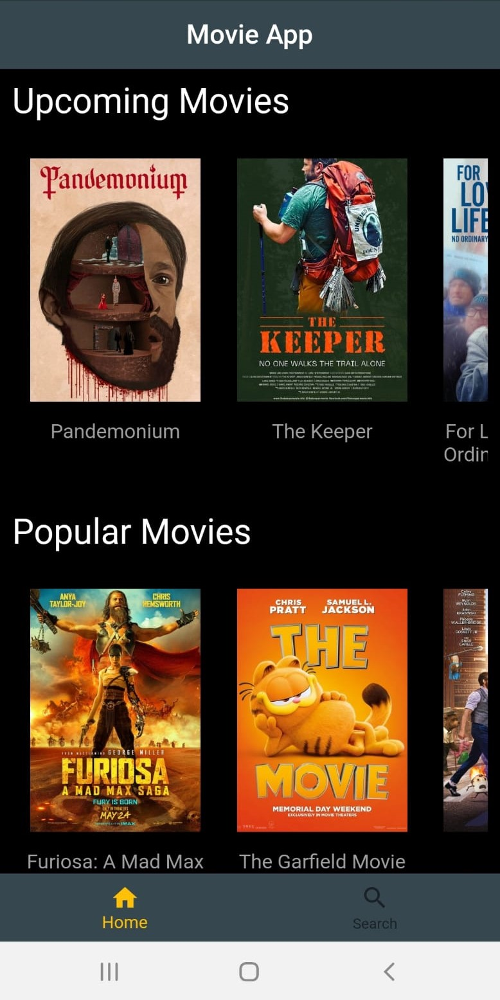

# Flutter Movie App 

This app is a Flutter mobile application that allows users to explore movie details, search for movies, and stay updated with the latest movie news. The app leverages the power of Cubit state management and dependency injection to ensure a clean and maintainable codebase.

## Feautures

- Main Page: Displays upcoming movies, popular movies, and the latest news.
- Search Page: Allows users to search for movies and access their details.
- Movie Detail Page: Provides detailed information about selected movies, including posters, movie details, cast and crew (with pictures), photo gallery, trailers, and reviews.

## Screenshots
### Home page 
- Upcoming Movies
- Popular Movies
- News

### Search Page
- Search Bar
- Search Results

### Movie Details Page
- Movie banter
- Movie poster
- Movie details:
    - Director
    - Genre
    - Release Date
    - Movie Rate
    - Synopsis
- Cast
- Crew
- Photo Gallery
- Trailer
- Reviews

## API Integration
The app retrieves data from [Flixster](https://rapidapi.com/apidojo/api/flixster) through Rapid API using Retrofit and Dio for network requests. Efficient data handling and parsing ensure real-time movie information is displayed to users.

## Acknowledgments

- Flixster API : For providing a comprehensive and up-to-date source of movie data.
- video_player and chewie packages : For the trailer. ([video_player-link](https://pub.dev/packages/video_player), [chewie-link](https://pub.dev/packages/chewie)) 
- photo_view package : For the photo gallery. ([photo_view-link](https://pub.dev/packages/photo_view))
- url_launcher : For opening the news in a web browser. ([url_launcher-link](https://pub.dev/packages/url_launcher))
- cached_network_image : For handling default images for movie posters, cast, and crew. ([cached_network_image-link](https://pub.dev/packages/cached_network_image))
- retrofit and dio packages: For network requests. ([retrofit-link](https://pub.dev/packages/retrofit),[dio-link]https://pub.dev/packages/dio)
- google_fonts package : For the text fonts. ([google_fonts-link](https://pub.dev/packages/google_fonts))
- flutter_bloc package : For the Cubit state management. ([block-link](https://pub.dev/packages/flutter_bloc))
- get_it package : For dependency injection. ([get_it-link](https://pub.dev/packages/get_it))
- Flutter : For the framework.

## Contributing
Feel free to contribute by opening issues or submitting pull requests. 

## Contact
For questions or feedback, contact aslihanyoldas24@gmail.com

